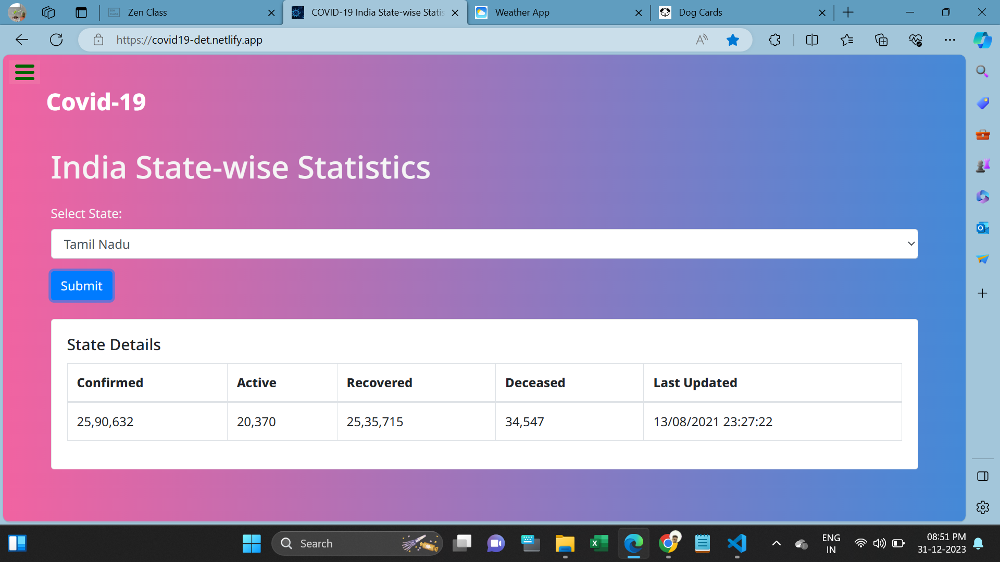

<h1>India Covid-19 API</h1>

This webpage is used to Check Covid-19 Case details.

In this page holds Covid-19 Confirmed cases, Acive cases, Recovered, Deceased and Last update from the selected state.

Users must select state name from the Dropdownlist then will getting case details after the submission.

I used Html,CSS,Bootstrap,Javascript using fetch API for developing this page.

I attached Webpage Screenshots in below:
   

<h2>Website URL</h2>
https://covid19-det.netlify.app/

<h2>Screenshots</h2>

1. Its main web page

 

2. After submission

 
